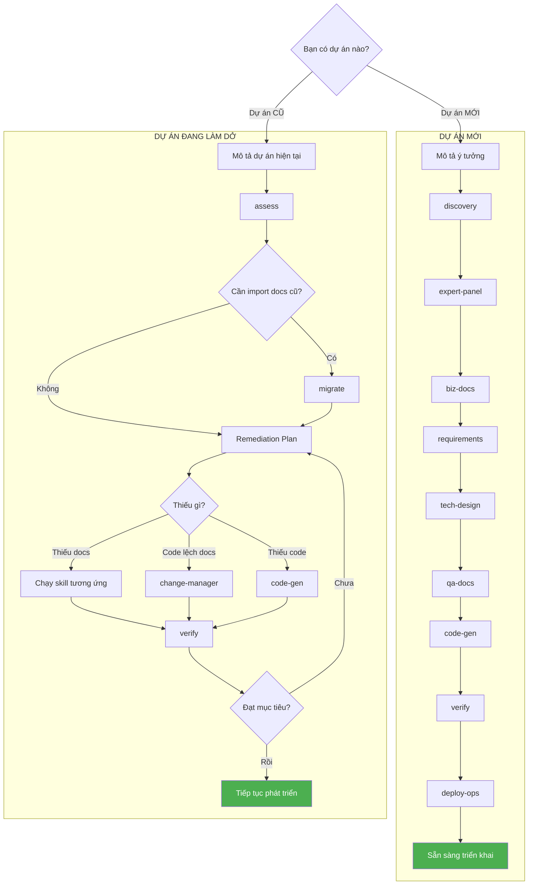

# MCV3-DevKit — MasterCraft DevKit v3

[](https://github.com/hanoibanhcuon/MCV3-Plugin/releases)
[](https://github.com/hanoibanhcuon/MCV3-Plugin)
[](LICENSE)

> **Phiên bản:** 3.12.0 | **Cập nhật:** 2026-03-20

---

## MCV3-DevKit là gì?

**MasterCraft DevKit v3 (MCV3)** là plugin cho Claude Code giúp bạn biến ý tưởng thành phần mềm hoàn chỉnh — từ tài liệu nghiệp vụ, thiết kế kỹ thuật, đến code và kế hoạch triển khai — theo một quy trình chuẩn hóa, tự động.

Thay vì tự mình soạn tài liệu rời rạc, MCV3 dẫn bạn qua **8 bước** có logic rõ ràng: từ vấn đề kinh doanh → yêu cầu phần mềm → thiết kế → code → kiểm tra → triển khai. Mọi thứ đều có thể truy ngược nguồn gốc để kiểm tra tính nhất quán.

---

## Dành cho ai?

| Bạn là | MCV3 giúp gì |
|--------|--------------|
| **Developer / Tech Lead** | Sinh code, test, API specs từ tài liệu — không tốn thời gian viết boilerplate |
| **PM / BA** | Tạo User Stories, Business Rules có cấu trúc — dễ trình bày với stakeholder |
| **Business Owner** | Mô tả ý tưởng bằng ngôn ngữ tự nhiên → nhận bộ tài liệu hoàn chỉnh để bàn giao team |
| **Thành viên mới** | Dùng `/mcv3:onboard` để hiểu nhanh dự án và quy trình làm việc |

---

## Yêu cầu

| Yêu cầu | Phiên bản |
|---------|----------|
| **Node.js** | v18 trở lên |
| **Claude Code** | Phiên bản mới nhất |
| **npm** | v8+ *(tự động có khi cài Node.js)* |

---

## Cài đặt

MCV3 cung cấp 3 cách cài đặt. Chọn cách phù hợp nhất với bạn.

### Cách 1: Clone repository (khuyến nghị)

Phù hợp khi bạn muốn cập nhật dễ dàng bằng `git pull`.

```bash
# 1. Clone plugin về máy
git clone https://github.com/hanoibanhcuon/MCV3-Plugin.git

# 2. Chạy installer — trỏ vào thư mục dự án của bạn
cd MCV3-Plugin
bash scripts/install.sh /đường/dẫn/đến/dự-án

# Windows (PowerShell):
.\scripts\install.ps1 -ProjectPath "C:\đường\dẫn\đến\dự-án"
```

### Cách 2: Tải file Release

Phù hợp khi bạn không cần git.

**Bước 1:** Tải file `mcv3-devkit-3.12.0.zip` từ trang [Releases](https://github.com/hanoibanhcuon/MCV3-Plugin/releases)

**Bước 2:** Giải nén và chạy installer:

```bash
# Mac / Linux / Git Bash:
unzip mcv3-devkit-3.12.0.zip
cd mcv3-devkit-3.12.0
bash scripts/install.sh /đường/dẫn/đến/dự-án
```

```powershell
# Windows (PowerShell):
Expand-Archive .\mcv3-devkit-3.12.0.zip -DestinationPath .
cd mcv3-devkit-3.12.0
.\scripts\install.ps1 -ProjectPath "C:\đường\dẫn\đến\dự-án"
```

### Cách 3: Cài thủ công (Plugin Mode)

Phù hợp khi bạn muốn kiểm soát hoàn toàn cấu hình.

**Bước 1:** Tải hoặc clone plugin về máy (như Cách 1 hoặc 2)

**Bước 2:** Copy thư mục plugin vào dự án:

```bash
# Copy toàn bộ plugin vào dự án, đặt tên mcv3-devkit/
cp -r MCV3-Plugin /đường/dẫn/đến/dự-án/mcv3-devkit
```

**Bước 3:** Tạo file `.mcp.json` tại root dự án:

```json
{
  "mcpServers": {
    "mcv3-project-memory": {
      "type": "stdio",
      "command": "node",
      "args": ["mcv3-devkit/mcp-servers/project-memory/dist/index.js"],
      "env": {
        "MCV3_PROJECT_ROOT": "."
      }
    }
  }
}
```

**Bước 4:** Copy slash commands:

```bash
# Tạo thư mục commands
mkdir -p /đường/dẫn/đến/dự-án/.claude/commands/mcv3

# Copy command files
cp mcv3-devkit/.claude/commands/mcv3/*.md /đường/dẫn/đến/dự-án/.claude/commands/mcv3/
```

**Bước 5:** Build MCP Server:

```bash
cd /đường/dẫn/đến/dự-án/mcv3-devkit/mcp-servers/project-memory
npm install
npm run build
```

**Bước 6:** Mở dự án trong Claude Code và verify:

```
/mcv3:status
```

### Kiểm tra cài đặt

Sau khi cài bằng bất kỳ cách nào, mở thư mục dự án trong Claude Code và chạy:

```
/mcv3:status
```

Nếu hiển thị thông tin dự án hoặc "No projects found" → cài đặt thành công.

### Cấu trúc sau khi cài

```
dự-án-của-bạn/
├── .mcp.json                         ← Cấu hình MCP Server
├── .claude/
│   ├── CLAUDE.md                     ← Hướng dẫn Claude hiểu MCV3
│   ├── settings.json                 ← Hooks configuration
│   └── commands/mcv3/                ← Slash commands (/mcv3:*)
├── mcv3-devkit/                      ← Plugin (không cần sửa)
│   ├── .claude-plugin/plugin.json
│   ├── skills/
│   ├── agents/
│   ├── templates/
│   ├── scripts/
│   ├── hooks/
│   ├── knowledge/
│   └── mcp-servers/
└── .mc-data/                         ← Dữ liệu dự án (tự tạo khi chạy)
```

---

## Cập nhật

Khi có phiên bản mới:

```bash
# Nếu cài bằng git clone — pull rồi chạy lại installer:
cd MCV3-Plugin
git pull
bash scripts/install.sh /đường/dẫn/đến/dự-án --update

# Nếu cài bằng zip — tải bản mới rồi chạy lại installer:
bash scripts/install.sh /đường/dẫn/đến/dự-án --update
```

Dữ liệu dự án trong `.mc-data/` **giữ nguyên**, không bị ảnh hưởng khi update.

---

## Sử dụng MCV3 cho dự án MỚI

Bạn mô tả ý tưởng → MCV3 tự động phỏng vấn, tạo tài liệu, thiết kế, sinh code, kiểm tra, và lập kế hoạch triển khai. Bạn chỉ cần review kết quả và xác nhận hoặc yêu cầu thay đổi.

**Lệnh bắt đầu:** `/mcv3:discovery`

**Ví dụ prompt:**
```
Tôi muốn làm app quản lý nhà hàng. Cần: quản lý order, quản lý bàn,
quản lý kho nguyên liệu, báo cáo doanh thu. Có app cho nhân viên phục vụ
và dashboard cho quản lý.
```

MCV3 sẽ hỏi thêm vài câu để làm rõ, rồi tự chạy qua các bước cần thiết.

---

### Dự án nhỏ (landing page, portfolio, tool nội bộ đơn giản)

MCV3 tự nhận ra dự án nhỏ và **bỏ qua các bước không cần thiết** — chỉ làm: khám phá → thiết kế → code. Không cần bạn cấu hình gì thêm.

**Ví dụ prompt:**
```
Tôi cần làm landing page giới thiệu sản phẩm mới của công ty, có form
đăng ký nhận thông tin và kết nối Google Analytics.
```

---

### Dự án lớn (ERP, nhiều hệ thống, nhiều người dùng)

MCV3 chạy đầy đủ 8 bước, xử lý từng hệ thống theo đúng thứ tự dependency.

**Ví dụ prompt:**
```
Dự án ERP cho công ty logistics. Cần các module: quản lý kho, quản lý đơn hàng,
quản lý vận chuyển, kế toán. Có web admin và app mobile cho tài xế.
```

---

## Sử dụng MCV3 cho dự án ĐANG LÀM DỞ

Nhận bàn giao code/docs cũ, hoặc dự án đã code một phần nhưng tài liệu chưa đồng bộ? MCV3 đánh giá hiện trạng, tìm ra thiếu sót, và đề xuất kế hoạch bổ sung.

**Lệnh bắt đầu:** `/mcv3:assess`

**Ví dụ prompt:**
```
Dự án ERP đang code được 60%, có docs Word cũ từ năm ngoái, code và docs
chưa đồng bộ. Cần đánh giá và tiếp tục phát triển.
```

MCV3 sẽ: scan code + docs hiện có → phân tích gap → đề xuất bổ sung theo thứ tự ưu tiên → tự bổ sung khi bạn đồng ý.

---

## Workflow tổng quan



**Tóm tắt:** Dự án MỚI — mô tả ý tưởng → MCV3 tự động đi qua 8 bước → sẵn sàng triển khai (dự án nhỏ tự bỏ bước không cần thiết). Dự án CŨ — assess hiện trạng → tìm gaps → chạy theo Remediation Plan → verify → lặp đến khi đạt mục tiêu.

---

## Các lệnh chính

| Lệnh | Khi nào dùng | Ví dụ prompt |
|------|-------------|--------------|
| `/mcv3:discovery` | Bắt đầu dự án mới | "Tôi muốn làm app quản lý bán hàng..." |
| `/mcv3:assess` | Đánh giá dự án đang làm dở | "Dự án đang code 60%, cần đánh giá..." |
| `/mcv3:status` | Xem tiến độ dự án hiện tại | "Dự án đang ở giai đoạn nào rồi?" |
| `/mcv3:expert-panel` | Phân tích chuyên gia sau khám phá | *(chạy tự động sau discovery)* |
| `/mcv3:biz-docs` | Tạo tài liệu nghiệp vụ | *(chạy tự động sau expert panel)* |
| `/mcv3:requirements` | Viết yêu cầu phần mềm chi tiết | *(chạy tự động sau biz-docs)* |
| `/mcv3:tech-design` | Thiết kế kỹ thuật (API, database) | *(chạy tự động sau requirements)* |
| `/mcv3:qa-docs` | Tạo test cases và hướng dẫn sử dụng | *(chạy tự động sau tech-design)* |
| `/mcv3:code-gen` | Sinh code từ tài liệu thiết kế | "Sinh code cho module kho hàng" |
| `/mcv3:verify` | Kiểm tra toàn bộ dự án | "Kiểm tra lại dự án xem có thiếu sót gì không" |
| `/mcv3:deploy-ops` | Tạo kế hoạch triển khai | "Tạo kế hoạch deploy lên production" |
| `/mcv3:change-manager` | Quản lý thay đổi yêu cầu | "Stakeholder muốn thay đổi quy trình tính giá" |
| `/mcv3:evolve` | Thêm tính năng/module mới | "Thêm module HR vào hệ thống ERP" |
| `/mcv3:migrate` | Import tài liệu cũ vào MCV3 | "Có docs Word cũ, cần chuyển sang MCV3" |
| `/mcv3:onboard` | Hướng dẫn cho thành viên mới | "Tôi mới vào team, cần hiểu dự án này" |

---

## Cách MCV3 làm việc

- **Chạy tự động** — MCV3 tự chọn thứ tự xử lý, tự quyết định khi gặp tình huống không rõ ràng, không dừng hỏi giữa chừng (ngoại trừ giai đoạn khám phá dự án cần input từ bạn)
- **Tự tư vấn** — Khi gặp vấn đề phức tạp, MCV3 tham vấn "hội đồng chuyên gia ảo" (domain expert, tech expert, finance expert...) rồi chọn phương án tốt nhất
- **Báo cáo tóm tắt** — Sau mỗi bước, MCV3 chỉ hiển thị tóm tắt ngắn (tên file đã tạo, quyết định quan trọng). Bạn có thể yêu cầu xem chi tiết bất kỳ file nào
- **Bạn review** — Đọc tóm tắt → đồng ý tiếp tục, hoặc mô tả thay đổi → MCV3 tự cập nhật
- **Gợi ý bước tiếp** — Sau mỗi bước MCV3 luôn gợi ý lệnh tiếp theo

---

## 12 Ngành nghề hỗ trợ chuyên sâu

MCV3 hiểu đặc thù từng ngành (quy trình, quy định pháp lý, thuật ngữ chuyên môn):

| Ngành | Đặc thù nổi bật |
|-------|----------------|
| F&B | Menu, bếp, giao hàng, POS |
| Retail / Bán lẻ | POS, kho, omnichannel |
| Logistics / Xuất nhập khẩu | WMS, TMS, vận tải |
| E-Commerce | Giỏ hàng, thanh toán, marketplace |
| Healthcare / Y tế | EMR, BHYT, quy định KCB |
| Fintech | Core banking, AML, PCI-DSS |
| SaaS | Subscription, onboarding, churn |
| Manufacturing | BOM, MRP, ISO 9001 |
| Real Estate | Quản lý BĐS, Luật Đất đai 2024 |
| HR / HRM | Bảng lương, BHXH, Bộ Luật LĐ 2019 |
| Education | LMS, quản lý học sinh, Bộ GD&ĐT |
| Embedded / IoT | Firmware, MCU, giao thức IoT, smart home/farm |

---

## Lưu ý quan trọng khi sử dụng

1. **Mô tả càng chi tiết → kết quả càng chính xác** — Đừng ngại viết dài, hãy mô tả đầy đủ nghiệp vụ, đối tượng người dùng, và các quy trình hiện tại
2. **Dự án nhỏ không cần chạy hết tất cả bước** — MCV3 tự điều chỉnh theo quy mô, bạn không cần lo
3. **MCV3 tự lưu file, bạn chỉ cần review tóm tắt** — Không cần copy-paste nội dung tài liệu
4. **Khi muốn thay đổi** — Dùng `/mcv3:change-manager` mô tả thay đổi, MCV3 tự cập nhật tất cả tài liệu liên quan và phân tích tác động
5. **Kiểm tra bất kỳ lúc nào** — `/mcv3:verify` để kiểm tra toàn bộ tính nhất quán của dự án
6. **Xem tiến độ bất kỳ lúc nào** — `/mcv3:status` để biết dự án đang ở bước nào

---

## Ví dụ prompt thực tế

### Bắt đầu dự án mới
```
/mcv3:discovery

Tôi muốn làm ứng dụng quản lý nhà hàng. Cần các tính năng:
- Quản lý order (gọi món, thêm/sửa/hủy, tách/gộp bill)
- Quản lý bàn (sơ đồ bàn, trạng thái bàn)
- Quản lý kho nguyên liệu (nhập kho, xuất kho, cảnh báo tồn kho thấp)
- Báo cáo doanh thu theo ngày/tháng/món ăn
Có app cho nhân viên phục vụ (iOS/Android) và web dashboard cho quản lý.
Quy mô: 1 chi nhánh, khoảng 50 bàn, 20 nhân viên.
```

### Tiếp tục dự án đang làm dở
```
/mcv3:assess

Dự án ERP cho công ty logistics, đang phát triển được 8 tháng.
Backend NestJS đã xong khoảng 60%, có docs Word từ năm ngoái nhưng
code và docs chưa đồng bộ. Cần đánh giá hiện trạng và lên kế hoạch
hoàn thiện trong 3 tháng tới.
```

### Thêm tính năng mới vào dự án đang chạy
```
/mcv3:evolve

Thêm module quản lý nhân sự (HR) vào hệ thống ERP hiện tại.
Cần: chấm công (máy chấm công + app), tính lương, đóng BHXH,
quản lý nghỉ phép. Kết nối với module kế toán đã có.
```

### Import tài liệu cũ
```
/mcv3:migrate

Có file Word "Đặc tả yêu cầu phần mềm v2.3.docx" và "Thiết kế DB.xlsx"
từ dự án cũ năm 2023. Cần convert vào MCV3 để tiếp tục phát triển.
```

### Kiểm tra dự án
```
/mcv3:verify

Kiểm tra toàn bộ dự án xem có thiếu sót gì không, đặc biệt giữa
tài liệu yêu cầu và code đã sinh.
```

### Thay đổi yêu cầu
```
/mcv3:change-manager

Stakeholder muốn thay đổi quy trình tính giá vận chuyển:
Trước đây tính theo km, nay muốn tính theo vùng (4 vùng địa lý).
Cần phân tích tác động và cập nhật tài liệu liên quan.
```

---

## Hỗ trợ

- **GitHub:** [github.com/hanoibanhcuon/MCV3-Plugin](https://github.com/hanoibanhcuon/MCV3-Plugin)
- **Issues:** [Báo lỗi / đề xuất](https://github.com/hanoibanhcuon/MCV3-Plugin/issues) — Mô tả lệnh đã chạy, tên dự án (slug), và lỗi gặp phải
- **Đóng góp:** Xem [CONTRIBUTING.md](CONTRIBUTING.md)
- **License:** [MIT](LICENSE)
