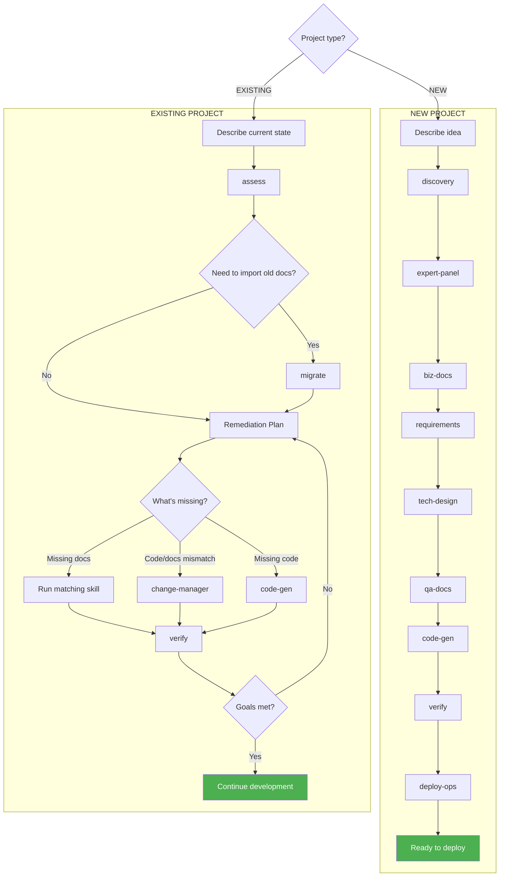

# MCV3-DevKit — MasterCraft DevKit v3

[](https://github.com/hanoibanhcuon/MCV3-Plugin/releases)
[](https://github.com/hanoibanhcuon/MCV3-Plugin)
[](LICENSE)

> **Version:** 3.12.0 | **Updated:** 2026-03-20

**MasterCraft DevKit v3 (MCV3)** is a Claude Code plugin that transforms your ideas into complete software — from business documentation, technical design, to production code and deployment plans — through a standardized, automated 8-phase pipeline.

Instead of writing scattered documents yourself, MCV3 guides you through **8 logical steps**: business problem → software requirements → technical design → code → testing → deployment. Everything is traceable end-to-end for consistency verification.

---

## Who is this for?

| You are | MCV3 helps you |
|---------|---------------|
| **Developer / Tech Lead** | Generate code, tests, API specs from documentation — no boilerplate |
| **PM / BA** | Create structured User Stories, Business Rules — easy to present to stakeholders |
| **Business Owner** | Describe your idea in natural language → get a complete document set to hand off to the dev team |
| **New team member** | Run `/mcv3:onboard` to quickly understand the project and workflow |

---

## Installation

### Prerequisites

| Requirement | Version |
|------------|---------|
| **Node.js** | v18+ |
| **Claude Code** | Latest |

### Option 1: Git Clone (recommended)

```bash
git clone https://github.com/hanoibanhcuon/MCV3-Plugin.git
cd MCV3-Plugin
bash scripts/install.sh /path/to/your-project
```

### Option 2: Download Release

Download the latest `.zip` from [Releases](https://github.com/hanoibanhcuon/MCV3-Plugin/releases), then:

```bash
unzip mcv3-devkit-3.12.0.zip
cd mcv3-devkit-3.12.0
bash scripts/install.sh /path/to/your-project
```

### Option 3: Windows (PowerShell)

```powershell
# Clone
git clone https://github.com/hanoibanhcuon/MCV3-Plugin.git
cd MCV3-Plugin

# Install
.\scripts\install.ps1 -ProjectPath "C:\path\to\your-project"
```

### Verify installation

Open your project directory in Claude Code and run:

```
/mcv3:status
```

If it responds with your project info, you're all set.

### Update to latest version

```bash
bash scripts/install.sh /path/to/your-project --update
```

Project data in `.mc-data/` is preserved during updates.

---

## Quick Start

### New project

Describe your idea, then MCV3 automatically interviews you, generates documentation, designs the architecture, generates code, runs verification, and creates a deployment plan.

```
/mcv3:discovery

I want to build a restaurant management app. Features needed:
- Order management (place, modify, cancel, split/merge bills)
- Table management (floor plan, table status)
- Inventory (stock in/out, low stock alerts)
- Revenue reports by day/month/dish
Staff app (iOS/Android) + web dashboard for managers.
Scale: 1 branch, ~50 tables, 20 staff.
```

MCV3 will ask a few clarifying questions, then autonomously run through all necessary phases.

### Existing project (in-progress)

Have legacy code/docs, or a partially-built project with out-of-sync documentation? MCV3 assesses the current state, identifies gaps, and proposes a remediation plan.

```
/mcv3:assess

ERP project for a logistics company, 8 months in development.
Backend NestJS ~60% done, have Word docs from last year but
code and docs are out of sync. Need assessment and a plan
to complete within 3 months.
```

---

## Pipeline Overview



**Small projects** (landing pages, internal tools) automatically skip unnecessary phases.
**Large projects** (ERP, multi-system) run the full 8-phase pipeline with proper dependency ordering.

---

## Commands Reference

| Command | When to use | Example |
|---------|------------|---------|
| `/mcv3:discovery` | Start a new project | "I want to build a sales management app..." |
| `/mcv3:assess` | Assess an in-progress project | "Project is 60% coded, needs assessment..." |
| `/mcv3:status` | Check project progress | "What phase is the project at?" |
| `/mcv3:expert-panel` | Expert analysis after discovery | *(runs automatically)* |
| `/mcv3:biz-docs` | Generate business documentation | *(runs automatically)* |
| `/mcv3:requirements` | Write detailed software requirements | *(runs automatically)* |
| `/mcv3:tech-design` | Technical design (API, database) | *(runs automatically)* |
| `/mcv3:qa-docs` | Generate test cases & user guides | *(runs automatically)* |
| `/mcv3:code-gen` | Generate code from design docs | "Generate code for the inventory module" |
| `/mcv3:verify` | Verify entire project consistency | "Check the project for any gaps" |
| `/mcv3:deploy-ops` | Create deployment plan | "Create a production deploy plan" |
| `/mcv3:change-manager` | Manage requirement changes | "Stakeholder wants to change the pricing flow" |
| `/mcv3:evolve` | Add new features/modules | "Add an HR module to the ERP system" |
| `/mcv3:migrate` | Import legacy docs into MCV3 | "Have old Word docs, need to convert to MCV3" |
| `/mcv3:onboard` | Tutorial for new team members | "I'm new to the team, need to understand this project" |

---

## How MCV3 Works

- **Fully autonomous** — MCV3 chooses processing order, makes decisions when ambiguous, never stops to ask mid-process (except during discovery phase which needs your input)
- **Self-consulting** — When facing complex decisions, MCV3 consults a "virtual expert panel" (domain, tech, finance experts) and picks the best option
- **Summary reports** — After each phase, shows only a brief summary (files created, key decisions). You can request details on any file
- **You review** — Read the summary → approve to continue, or describe changes → MCV3 auto-updates
- **Next step suggestions** — Always suggests the next command after each phase

---

## 12 Industry Knowledge Bases

MCV3 understands industry-specific workflows, regulations, and terminology:

| Industry | Key Focus |
|----------|----------|
| F&B | Menu, kitchen ops, delivery, POS |
| Retail | POS, inventory, omnichannel |
| Logistics | WMS, TMS, transportation |
| E-Commerce | Cart, checkout, marketplace |
| Healthcare | EMR, insurance, medical regulations |
| Fintech | Core banking, AML, PCI-DSS |
| SaaS | Subscription, onboarding, churn |
| Manufacturing | BOM, MRP, ISO 9001 |
| Real Estate | Property management, land law |
| HR / HRM | Payroll, social insurance, labor law |
| Education | LMS, student management |
| Embedded / IoT | Firmware, MCU, IoT protocols, smart home/farm |

---

## Tips

1. **More detail = better results** — Don't hesitate to write long descriptions of your business processes, user types, and current workflows
2. **Small projects auto-scale** — MCV3 adjusts the pipeline based on project size, no configuration needed
3. **MCV3 saves files automatically** — You only need to review summaries, no copy-paste required
4. **Requirement changes** — Use `/mcv3:change-manager` to describe changes; MCV3 auto-updates all affected documents with impact analysis
5. **Verify anytime** — `/mcv3:verify` checks end-to-end consistency across all project documents
6. **Check progress anytime** — `/mcv3:status` shows current phase and next steps

---

## Support

- **GitHub:** [github.com/hanoibanhcuon/MCV3-Plugin](https://github.com/hanoibanhcuon/MCV3-Plugin)
- **Issues:** [Report bugs / feature requests](https://github.com/hanoibanhcuon/MCV3-Plugin/issues)
- **Contributing:** See [CONTRIBUTING.md](CONTRIBUTING.md)
- **License:** [MIT](LICENSE)
